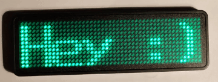

# LEDTool
A tool to communicate with the 'VADIV LED-NAMETAG' through USB-HID interface. (WIP)

The protocol and communication is based on USB packets sniffed out with Wireshark, which have been sent by the included windows software.

```
Device 12x48 (VID:0x483, PID:0x5750)
STMicroelectronics 0STM32 Composite MSC+HID
```



## Things to do
+ Better pixel font
+ Device temperature feature
+ Multiple programs and screens
+ Write bitmaps and custom data
+ Support for more than one screen
+ Buildin images

## Build
#### Prerequisites
```
# Debian
sudo apt-get install make gcc libusb-1.0-0-dev
```
#### Building
```
make
```

## Example
If root privileges are required depends on your system.
```
sudo ./ledtool "test"
```
View all features
```
sudo ./ledtool --help
```

## Similar projects
[https://github.com/jnweiger/led-name-badge-ls32](https://github.com/jnweiger/led-name-badge-ls32)
[https://github.com/DirkReiners/LEDBadgeProgrammer](https://github.com/DirkReiners/LEDBadgeProgrammer)
[http://www.daveakerman.com/?p=1440](http://www.daveakerman.com/?p=1440)
